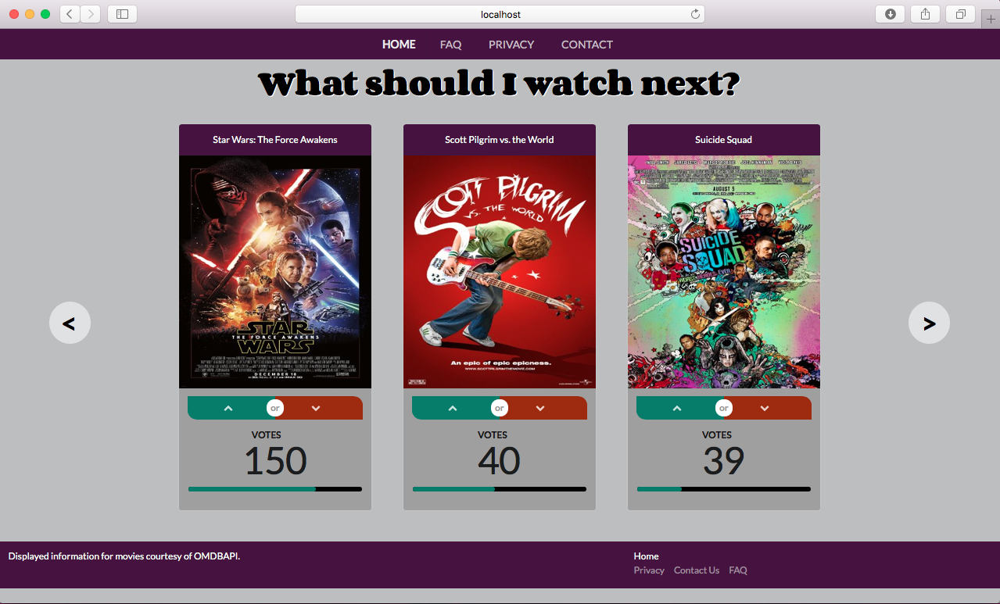
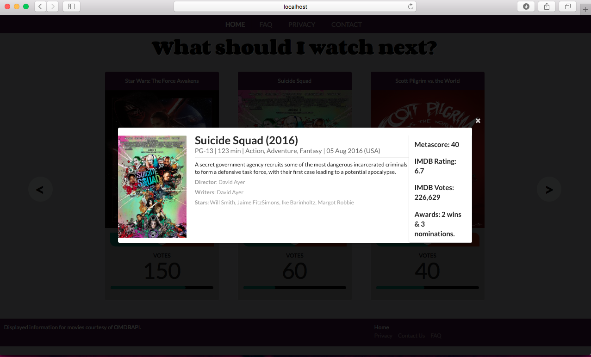

# 473-movie-app
 

### Type in Terminal: npm install  to install all of the dependencies
```
$ npm install
```


## 1) Store movies to database
Type in Terminal: node store_movies to store the movies listed in file movies.txt into the database.
```
$ node store_movies.js
```

## 2) Run the server
Type in Terminal: node server.js to run the server. it listens on port 3000
```
$ node server.js
```

## 3) Access the website

Go to browser and type localhost:3000
